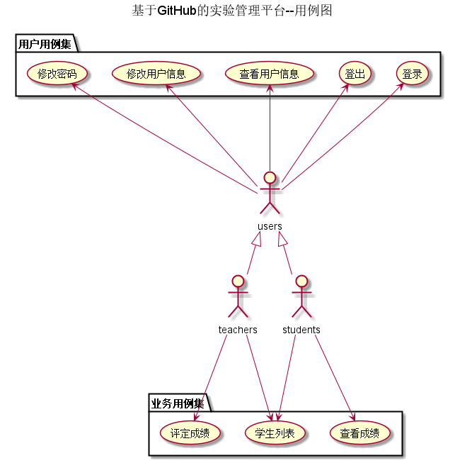
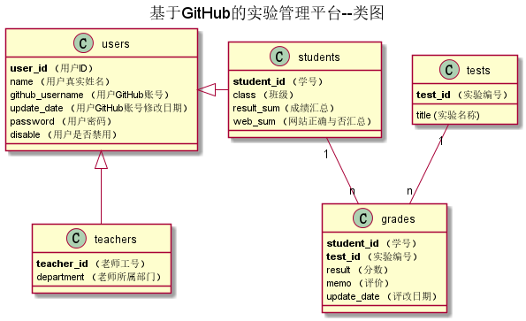
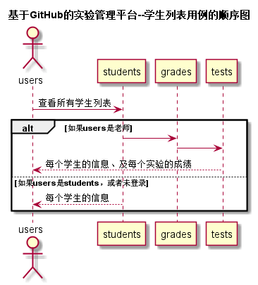
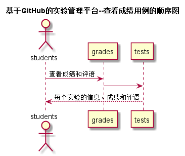
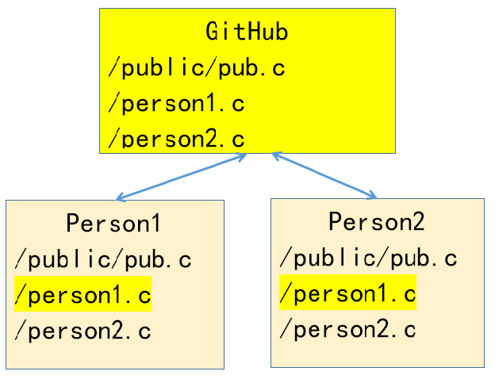

<!-- markdownlint-disable MD033-->
<!-- 禁止MD033类型的警告 https://www.npmjs.com/package/markdownlint -->

# 《信息系统分析与设计》（第4版）


清华大学出版社 王晓敏 邝孔武 编著 ， 主讲：成都大学信息科学与工程学院 赵卫东副教授

## 实验
- 实验平台地址：http://202.115.82.8/  学生用学号登录，初始密码等于学号

- ### [实验1：业务流程建模](./test1.md)
    - 实验1批改情况说明（大家都容易出现的问题有）：
        1. 没有按角色分组
        2. 没有文字说明，或者文字说明不清晰，没有划分段落
        3. 图片不清晰
    - 本实验比较优秀(90分以上)的同学如下:
    
    |学号|姓名|班级|成绩|
    |---|---|---|---|
    |201610414108|龙嘉鑫|软件(本)16-1|90|
    |201610414109|裴逸凡|软件(本)16-1|90|
    |201610414119|韦冬冬|软件(本)16-1|90|
    |201610414215|龙羿霖|软件(本)16-2|90|
    |201610414322|汤实鑫|软件(本)16-3|90|
    |201610414415|彭海峰|软件(本)16-4|94|


- ### [实验2：图书管理系统用例建模](./test2.md)
    - 实验2批改情况说明（大家都容易出现的问题有）：
        1. << include >>和<< extend >>写成了include和extend，没有<<>>符号    
        2. 滥用<< extend >>。extend只是用于特殊情况，异常情况，不能用于正常情况的用例。
    比如“书目维护”用例中的“增加”，“修改”，“删除”用例，
    不应该是<< extend >>关系，应该是<< include >>关系或者是<< use >>关系。
        3. 用例规约表应该在网页上应该是文字，不能是图片。
        4. 用例图中的用例名称与用例规约表的用例名称不符。
    - 本实验比较优秀(90分以上)的同学如下：
    
    |学号|姓名|班级|成绩|
    |---|---|---|---|
    |201610414105|兰迪|软件(本)16-1|94|
    |201610414108|龙嘉鑫|软件(本)16-1|94|
    |201610414119|韦冬冬|软件(本)16-1|93|
    |201610414202|常昊|软件(本)16-2|91|
    |201610414223|王天诗|软件(本)16-2|94|
    |201610414308|李文靖|软件(本)16-3|94|
    |201610414311|刘成|软件(本)16-3|91|
    |201610414325|吴伟辉|软件(本)16-3|94|
    |201610414415|彭海峰|软件(本)16-4|95|
    |201610414421|王宇|软件(本)16-4|94|

- ### [实验3：图书管理系统领域对象建模](./test3.md)
    - 实验3批改情况说明（大家都容易出现的问题有）：
        1. 应该是类图在前，对象图在后。整个系统最好只有一张类图，减小类的重复编写。  
        2. 类图中不需要对象图中的实例,比如不需要具体的姓名，具体的图书名称。
        3. 类图中的关联线条错误太多，关联线条的三要素：类别，方向和数字对应关系都应该设计正确。 
        4. 对象图中的数据要符合实事。比如，字符串要加单引号，数字不加引号，密码不要用明文。   
        5. 应该说明每个类由哪个用例产生，被哪些实例引用。
    - 本实比较优秀(90分以上)的同学如下：

    |学号|姓名|班级|成绩|
    |---|---|---|---|
    |201610414105|兰迪|软件(本)16-1|94|
    |201610414112|唐银浩|软件(本)16-1|91|
    |201610414119|韦冬冬|软件(本)16-1|96|    
    |201610414206|郭高余|软件(本)16-2|91|
    |201610414304|董凌|软件(本)16-3|90|    
    |201610414323|王涵玮|软件(本)16-3|90|    
    
- ### [实验4：图书管理系统顺序图绘制](./test4.md)
    - 实验4批改情况说明（大家都容易出现的问题有）：
        1. 顺序图中的消息如果要加序号，最好是2级编号。顺序图本身就是按时间顺序由上到下排列的。
        2. 实验2的类图中的类在顺序图中没有足够的体现，或者名称不匹配。
        3. 与实验3中的对象名称不完全吻合。“界面”，“系统”等非对象不应该出现在时序图对象列中。
        4. 发送信息应该是实线，返回的消息线条应该是虚线
        5. 主要顺序图无返回消息
        
    - 注意，用例图，类图，顺序图一定要相互联系，互相参照。
    - 本实验比较优秀(90分以上)的同学如下：
      	      
    |学号|姓名|班级|成绩|
    |---|---|---|---|		
    |201610414117|王杉文|软件(本)16-1|90|
    |201610414119|韦冬冬|软件(本)16-1|95|    
    |201610414129|周丕也|软件(本)16-1|90|
    |201610414208|蒋雯|软件(本)16-2|90|
    |201610414414|穆峥言|软件(本)16-4|91|
    |201610414422|肖清宇|软件(本)16-4|91|
    
          
    - 老师编写的[基于GitHub的实验管理平台](http://202.115.82.8/)的用例图，类图，顺序图如下：
        - 用例图(只有一个)：
    
         
        
        说明：学生列表用例是主页面，不需要登录也可访问。
        
        - 类图(只有一个)：
    
        -          
              
        - 顺序图(每个用例一个，登录，登出等基本用例省略了)：
    
        - 
        
        说明：老师和学生在学生列表用例中看到的数据不完全相同，老师可以看到成绩。
        
       - 
        
        -
        
- ### [实验5：图书管理系统数据库设计与界面设计](./test5.md)
    - 实验5批改情况说明（大家都容易出现的问题有）：
        
          1. 数据库表的字段与类图的属性不符。
          2. 界面控件与表的字段属性不符。
          3. 如果表的字段是外键，一定要写明参照表。
          4. 不要滥用“可以为空”，一定要实事求是。特别是图书的借书日期必须不能为空，但是归还日期必须允许为空，为空表示没有归还，不为空表示实际归还日期。
          5. 表的类型，使用int(100)太大了，正确的用法是int。datetime(50)也不正确，正确的用法是：datetime。
          6. 图书馆中的每一种图书（ISBN号相同的图书）都可能有很多本，每一本都有不同的流水号（图书馆的自编号），
          读者借书应该是针对<b>流水号</b>借书，而不是ISBN号。如果张三和李四都借了ISBN号相同的书，张三弄丢了他借的图书，
          而这时张三正好拿到了李四借的书，他想用李四的书冒充自己借的书去还书，结果仍然是帮李四还了，冒充还书不会成功！
          7. 一个表中只能有一个主键。可以由多个字段组成联合主键，但主键只能有一个。
          8. API接口参数“method 固定为POST”的设计不合理。method不应该是参数名称。
          9. 增加图书的POST接口，很多同学输入的图书参数只有一个，是book对象（比如JavaBean），这样不正确，原因是为了解耦，接口必须是独立的，与任何语言无关。正确的写法是输入的参数是图书的所有主要属性，但不含图书的BookID，BookID应该是在添加图书成功之后，由系统自动生成，并通过接口返回，在返回的参数中出现BookID!
          
    - 本实验比较优秀(90分以上)的同学如下： 
      	      
    |学号|姓名|班级|成绩|
    |---|---|---|---|		
    |201610414112|唐银浩|软件(本)16-1|92|    
    |201610414129|周丕也|软件(本)16-1|94|    
    |201610414207|胡文睿|软件(本)16-2|90|    
    |201610414229|张宇芹|软件(本)16-2|90|    
    |201610414314|刘宇坤|软件(本)16-3|91|      
    |201610414422|肖清宇|软件(本)16-4|91| 
            
    - 老师编写的[基于GitHub的实验管理平台](http://202.115.82.8/)的表结构如下：
      
        - [数据库设计](./test6/数据库设计.md)
      
    - 老师编写的[基于GitHub的实验管理平台](http://202.115.82.8/)的API接口如下:
    
    - getStudents接口
        
        - 功能：
            返回所有学生的列表。   
            
            学生登录，或者未登录不能看到RESULT_SUM，WEB_SUM，老师登录可以看到RESULT_SUM，WEB_SUM。
            
            该接口服务于：http://202.115.82.8/
            
        - API请求地址： 
           http://202.115.82.8/v1/api/getStudents
        
        - 请求方式 ：
            GET  
        
        - 请求参数说明:        
            无
            
        - 返回实例：

                {
                    "status": true,
                    "info": null, 
                    "total": 121,         
                    "data": [
                        {"WEB_SUM": "Y,Y,Y,Y,Y,N", 
                        "RESULT_SUM": "83.75,90,80,80,85,N", 
                        "GITHUB_USERNAME": "Chinajuedui", 
                        "STUDENT_ID": "201510315203", 
                        "CLASS": "软件(本)15-1", 
                        "NAME": "陈松华", 
                        "UPDATE_DATE": "2018-04-02 13:48:01"}, 
                        {
                        ...其他学生
                        }
                    ] 
                }
          
        - 返回参数说明：    
         
          |参数名称|说明|
          |:---------:|:--------------------------------------------------------|      
          |status|bool类型，true表示正确的返回，false表示有错误|
          |info|返回结果说明信息|
          |total|返回学生人数|
          |data|所有学生的数组|
          |WEB_SUM|网址是否正确的汇总|
          |RESULT_SUM|成绩的汇总|
          |GITHUB_USERNAME|GITHUB 用户名|
          |STUDENT_ID|学号|
          |CLASS|班级|
          |NAME|真实姓名|
          |UPDATE_DATE|GitHUB用户名修改日期|
      
    - update_github_user接口
        
        - 功能：
            修改学生的GitHub用户名。   
            
            必须登录。
            该接口服务于：http://202.115.82.8/
            
        - API请求地址： 
            http://202.115.82.8/v1/api/update_github_user/学号/GitHub用户名
            
            样例：http://202.115.82.8/v1/api/update_github_user/201510414101/abc
            
        - 请求方式 ：
            GET，POST
            
            POST接口测试网址：http://coolaf.com/
            
        - 请求参数说明:      
                    
            |参数名称|必填|说明|
            |:---------:|------:|:--------------------------------------------------------|      
            |status|是|学号|
            |GitHub用户名|是|新的GitHub用户名|
            
        - 返回实例：
        
                {
                    "status": false, 
                    "info": "未登录,不能修改"
                }
          
        - 返回参数说明：    
         
          |参数名称|说明|
          |:---------:|:--------------------------------------------------------|      
          |status|bool类型，true表示正确的返回，false表示有错误|
          |info|返回结果说明信息|
              
## 实验6：期末考查说明
- 参见[期末考核要求](./test6.md)
- 老师的分析与设计：https://github.com/zwdbox/is_analysis/tree/master/test6
- 老师的源码: https://github.com/zwdbox/is_analysis/tree/master/项目/实验平台
- 你的实验内容提交成功后，可以直接访问https://github.com/<b>zhang</b>/is_analysis/tree/master/test6
 查看你编写的实验文档。其中zhang是你的gitHub用户名。

- 期末最终成绩说明：
    平时成绩（到课情况）占20%，5次实验成绩占40%，期末项目设计占40%。
    比如：平时成绩80分，5次实验成绩是：90,80,85,75,80，期末实验的成绩是67
    那么：**学期最终成绩**= 80*0.2 + (90+80+85+75+80)/5*0.4 + 67*0.4= 75.6分
    
- 注意：需要提交电子文档和打印的纸质文档。

- 提交日期是：**5月6日（即星期一上午1-4节原定上课时间，上课地点）**。
    
- 电子文档提交地址：https://github.com/你的gitHub用户名/is_analysis/tree/master/test6

- 期末考试要求及老师的文档参见：
    https://github.com/zwdbox/is_analysis/blob/master/test6.md
    
    和
    
    https://github.com/zwdbox/is_analysis/tree/master/test6
    
    - 本实验比较优秀(90分以上)的同学如下： 
      	      
    |学号|姓名|班级|成绩|
    |---|---|---|---|
    |201610414103|杜丽|软件(本)16-1|91|
    |201610414105|兰迪|软件(本)16-1|91|
    |201610414206|郭高余|软件(本)16-2|92|
    |201610414208|蒋雯|软件(本)16-2|93|
    |201610414222|王丽|软件(本)16-2|94|
    |201610414308|李文靖|软件(本)16-3|91|
    |201610414312|刘浪|软件(本)16-3|92|
    |201610414313|刘文君|软件(本)16-3|92|
    |201610414325|吴伟辉|软件(本)16-3|90|
    |201610414326|熊洪|软件(本)16-3|90|
    |201610414327|杨一鸣|软件(本)16-3|90|
    |201610414409|方琦|软件(本)16-4|94|
    |201610414414|穆峥言|软件(本)16-4|91|
        
## 搭建文档编写环境：
- 编辑器: IntelliJ IDEA
- IDEA插件: markdown 和 plantuml
- 单独安装: git 和 graphviz

## 参考资料
- 绘制方法参考：[PlantUML标准](http://plantuml.com)
- PlantUML服务: http://plantuml.com/zh/server
- plantuml在线编辑器： http://www.plantuml.com/plantuml
- Markdown格式参考：https://www.jianshu.com/p/b03a8d7b1719
- 老师的教学资源：https://github.com/zwdbox/is_analysis
- Git简书 https://git-scm.com/book/zh/v2
- Git分支 https://git-scm.com/book/zh/v1/Git-%E5%88%86%E6%94%AF
- Github 简明教程-操作标签 https://www.cnblogs.com/tracylxy/p/6439089.html
- Git菜鸟教程 http://www.runoob.com/git/git-tutorial.html
- [GitWindows客户端](./gitgfb_ttrar.rar)
- 版本控制样例参见：https://github.com/oracle/db-sample-schemas
- 文档编写工具 Sphinx 使用手册 https://of.gugud.com/t/topic/185 https://zh-sphinx-doc.readthedocs.io/en/latest/contents.html

## github在线显示plantuml图片
- 使用标准的****方式，地址格式是： http://www.plantuml.com/plantuml/proxy?cache=no&fmt=svg&src=https://zwdcdu.github.io/a.github.io/fig2.puml
    - cache=no表示不缓存，列容易适应文件的变化
    - fmt=svg表示以svg方式显示图形，这个很重要，否则汉字会显示为不同的字体。
    - https://zwdcdu.github.io/a.github.io/fig2.puml表示plantuml源码，可以是任何地址，只要返回plantuml源代码即可。

## git示例
### 克隆test资料库，如果test是私有项目，需要输入密码，clone完成后，会生成一个新的目录test
```
git clone https://github.com/你的github用户名/test.git
```
clone操作应该只做一次，会下载项目资料库中的所有文件、分支和标签，并新建一个.git隐藏目录，使本机和远程仓库建立关联。clone之后可以使用git pull下载修改文件。

### 配置test目录
```
cd test
ls
git config --global user.name "你的github用户名"
git config --global user.email 你的github邮箱
ls -a
```

### 在本机修改a.c，然后push到网站，需要输入用户名和密码
```
vi a.c
git add *
git commit -m 'zhang 修改'
git push
```

### 在网上修改文件a.c,然后pull到本机
```
git pull
cat a.c
```

