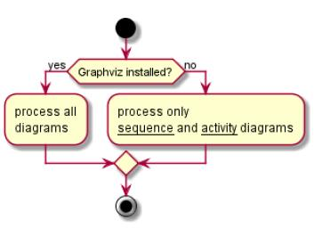

# 实验1：业务流程建模（老师示范）
|学号|班级|姓名|照片|
|:-------:|:-------------: | :----------:|:---:|
|12345678|软件(本)15-4|1.赵卫东||

## 流程图1：考试及成绩管理流程

**PlantUML源码如下：**

``` flow1
@startuml
start
:Hello world;
:This is on defined on
several **lines**;
stop
@enduml
```

**业务流程图如下：**


**流程说明：**

说明文字....

## 流程图2： 客户维修服务流程

**PlantUML源码如下：**

``` flow2
@startuml
start
if (Graphviz installed?) then (yes)
:process all\ndiagrams;
else (no)
:process only
__sequence__ and __activity__ diagrams;
endif
stop
@enduml
```

**业务流程图如下：**



**流程说明：**

说明文字....