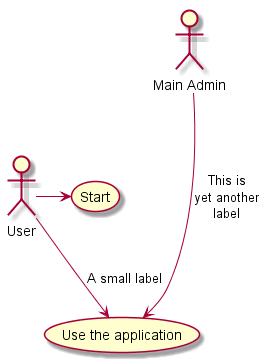
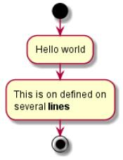

# 实验2：图书管理系统用例建模（老师示范）
|学号|班级|姓名|照片|
|:-------:|:-------------: | :----------:|:---:|
|12345678|软件(本)15-4|赵卫东||

## 1. 图书管理系统的用例关系图

### 1.1 用例图PlantUML源码如下：

``` usecase
@startuml

User -> (Start)
User --> (Use the application) : A small label

:Main Admin: ---> (Use the application) : This is\nyet another\nlabel

@enduml
```


### 1.2. 用例图如下：

参见图7.6



## 2. 参与者说明：

###     2.1 图书管理员

主要职责是：***

###     2.2 读者

主要职责是：****

###     2.3 其他类型用户
    
主要职责是：****

##     3. 用例规约表

###     3.1 “借出图书”用例

参见：表7.5

###     3.2 “购入图书”用例

参见：表7.5

**“购入图书”用例流程图源码如下：**
``` uc1_flow
@startuml
start
:Hello world;
:This is on defined on
several **lines**;
stop
@enduml
```

**“购入图书”用例流程图源码如下：**



###     3.3 “***”用例

参见：表7.5