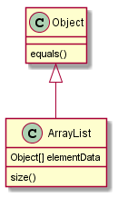
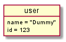

# 实验3：图书管理系统领域对象建模（老师示范）
|学号|班级|姓名|照片|
|:-------:|:-------------: | :----------:|:---:|
|12345678|软件(本)15-4|赵卫东||

## 1. 图书管理系统的类图

### 1.1 类图PlantUML源码如下：

``` class
@startuml
Object <|-- ArrayList
Object : equals()
ArrayList : Object[] elementData
ArrayList : size()
@enduml
```

### 1.2. 类图如下：

参见图8.17



### 1.3. 类图说明：
说明文字***

## 2. 图书管理系统的对象图
### 2.1 类user的对象图
#### 源码如下：
``` class
@startuml
object user {
name = "Dummy"
id = 123
}
@enduml
``` 
#### 对象图如下：


### 2.2 类***的对象图
#### 源码如下：
``` class
@startuml
object user2 {
name = "Dummy"
id = 123
}
@enduml
``` 
#### 对象图如下：
