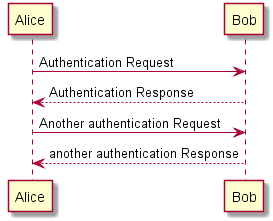
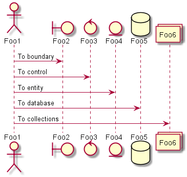

# 实验4：图书管理系统顺序图绘制（老师示范）
|学号|班级|姓名|照片|
|:-------:|:-------------: | :----------:|:---:|
|12345678|软件(本)15-4|赵卫东||

## 图书管理系统的顺序图

## 1. 借书用例
## 1.1. 借书用例PlantUML源码

``` sequence
@startuml
Alice -> Bob: Authentication Request
Bob --> Alice: Authentication Response

Alice -> Bob: Another authentication Request
Alice <-- Bob: another authentication Response
@enduml
```

## 1.2. 借书用例顺序图


## 1.3. 借书用例顺序图说明
ABCDE....

***

## 2. 还书用例
## 2.1. 还书用例PlantUML源码

``` sequence
@startuml
Alice -> Bob: Authentication Request
Bob --> Alice: Authentication Response

Alice -> Bob: Another authentication Request
Alice <-- Bob: another authentication Response
@enduml
```

## 2.2. 还书用例顺序图


## 2.3. 还书用例顺序图说明
ABCDE...
***