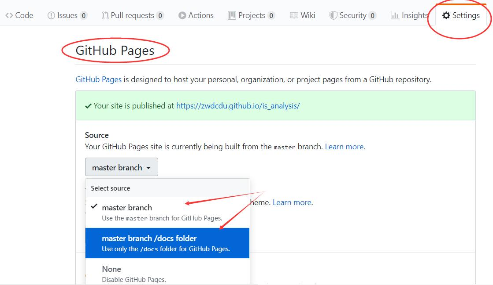

<!-- markdownlint-disable MD033-->
<!-- 禁止MD033类型的警告 https://www.npmjs.com/package/markdownlint -->

## 实验5 图书管理系统数据库设计与界面设计 | [返回](./README.md)

- 本实验的目的是掌握数据库设计与界面设计的初步方法。要求设计出数据库的<b>全部</b>二维表，
  以及借书、还书或者读者管理等主要页面中的<b>任意一个</b>。最后，还需要按照RESTFul API标准设计出界面的接口。
- 数据库设计的方法参见：第11章系统详细设计的11.5节数据库设计。
- 界面设计的方法参见：第11章系统详细设计的11.1节输出设计、11.2节人机对话设计，以及11.3节人机对话设计。
  界面设计工具可以使用[Axure](https://www.axure.com/)或者其他编辑工具。
- 本实验的基础是[实验2：图书管理系统用例建模](./test2.md)、[实验3：图书管理系统领域对象建模](./test3.md)
  以及[实验4：图书管理系统顺序图绘制](./test4.md)。
- 整个文档要汇总到README.md文本文件中进行说明，说明文件用Markdown格式编写。

<b>注意事项</b>

- 本实验中的数据库设计应该基于实验3的类图(Class Diagram)，绘制出每一张二维表，并写出主键，外键等主要约束及描述信息。
    - 为每个类型创建一张二维表；
    - 为每张表选择或发明一个主键；
    - 添加外键来表示实体间一对多的关系；
    - 创建一张新表来表示尚未分解的多对多的关系(拆为两个一对多关系)；
    - 确定各个关系模式中属性的数据类型、约束、规则和默认值，考虑域完整性；
    - 范式标准：基本表及其字段之间的关系, 应尽量满足第三范式。但是，满足第三范式的数据库设计，往往不是
     最好的设计。为了提高数据库的运行效率，常常需要降低范式标准：适当增加冗余，达到<b>以空间换时间的目的</b>。

- 界面设计应当清晰，直观，符合人体感观。

- 创建一个公有资料库**is_analysis_pages**,将is_analysis_pages设置为Pages，
    - 方法是：settings-->GitHub Pages，Source选择master branch或者/docs目录。
    - 在is_analysis_pages根目录或者is_analysis_pages/docs目录存入UI设计的Html文件，通过超链接访问这些文件。
    - https://你的用户名.github.io/is_analysis_pages/你的文件.html
    - 或者https://你的用户名.github.io/is_analysis_pages/你的文件.html
    - 设置方法见下图：
    
    - 老师设计的样例参见 https://zwdcdu.github.io/is_analysis/test5/ui/start.html

- RESTFUl API应该符合界面的设计。一个界面可以包含多个API接口。

<b>实验提交</b>

- 实验提交到自己的gitHub的is_analysis/test5目录中，主要文件名是：README.md，再附上一些图片文件。
- 你的gitHub中的is_analysis/test5目录中可能有以下文件：

``` filelist
README.md
pic1.png
...
```

- 你的实验内容提交成功后，可以直接访问https://github.com/<b>zhang</b>/is_analysis/tree/master/test5
查看你编写的实验文档。其中zhang是你的gitHub用户名。

- 请在2020-04-27之前提交，过时扣分。

<b>参考</b>

- AXURE界面设计工具参见： https://www.axure.com/
- RESTful API 设计指南参见：http://www.ruanyifeng.com/blog/2014/05/restful_api.html
- RESTful API 设计样例参见：http://os.opensns.cn/book/index/read/id/5.html
- 获得北京天气预报的API: https://www.sojson.com/open/api/weather/json.shtml?city=北京
- Markdown格式参考：https://www.jianshu.com/p/b03a8d7b1719
- 老师的教学资源：https://github.com/zwdcdu/is_analysis
- 老师以同学身份做的<b>伪实验5</b>参考：https://github.com/zwdcdu/is_analysis/tree/master/test5