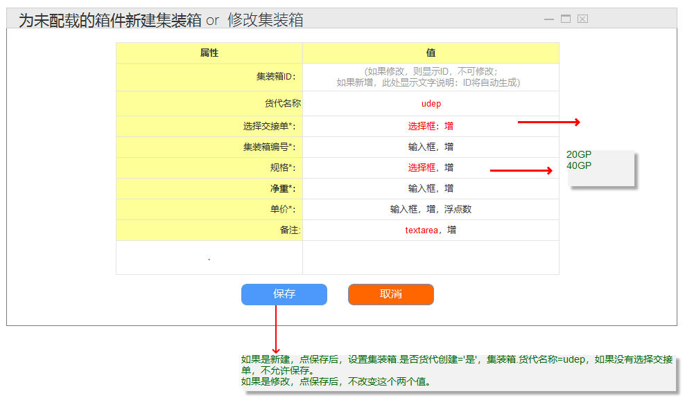

# 实验5：图书管理系统数据库设计与界面设计（老师示范）
|学号|班级|姓名|照片|
|:-------:|:-------------: | :----------:|:---:|
|12345678|软件(本)15-4|赵卫东||

## 1.数据库表设计

## 1.1. 图书表
|字段|类型|主键，外键|可以为空|默认值|约束|说明|
|:-------:|:-------------:|:------:|:----:|:---:|:----:|:-----|
|ISBN|varchar2(100)|主键|否||||
|Name|varchar2(100)| |否||||
|Memo|varchar2(100)| |是||||

## 1.2. ***表
|字段|类型|主键，外键|可以为空|默认值|约束|说明|
|:-------:|:-------------:|:------:|:----:|:---:|:----:|:-----|
|ISBN|varchar2(100)|主键|否||||
|Name|varchar2(100)| |否||||
|Memo|varchar2(100)| |是||||

***

## 2. 界面设计
## 2.1. 借书界面设计

- 用例图参见：借书用例
- 类图参见：借书类，读者类
- 顺序图参见：借书顺序图
- API接口如下：

1. 获取全部分类

- 功能：用于获取全部分类
- 请求地址： http://[YOUR_DOMAIN]/v1/api/shop_cate
- 请求方法：POST
- 请求参数：

|参数名称|必填|说明|
|:-------:|:-------------: | :----------:|
|access_token|是|用于验证请求合法性的认证信息。 |
|method|是|固定为 “GET”。|

- 返回实例：
```
{
    "info": "感谢您的支持。",
    "data": {
        "nickname": "O记_Mega可达鸭",
        "uid": "14361",
        "signature": "呀  一不小心就进化了",
        "score1": "322",
        "real_nickname": "O记_Mega可达鸭",
        "title": "Lv3 转正",
        "avatar128": "http://upload.opensns.cn/Uploads_Avatar_14361_58e4b58fccf81.jpg?imageMogr2/crop/!260x260a6a22/thumbnail/128x128!",
        "avatar512": "http://upload.opensns.cn/Uploads_Avatar_14361_58e4b58fccf81.jpg?imageMogr2/crop/!260x260a6a22/thumbnail/512x512!"
    },
    "code": 200
}
```
- 返回参数说明：
    
|参数名称|说明|
|:-------:|:-------------: |
|Info|返回信息|
|data|用户的个人信息|
|dodo|返回码|

2. *******API
- 功能：用于获取全部分类
- 请求地址： http://[YOUR_DOMAIN]/v1/api/shop_cate
- 请求方法：POST
- 请求参数：

|参数名称|必填|说明|
|:-------:|:-------------: | :----------:|
|access_token|是|用于验证请求合法性的认证信息。 |
|method|是|固定为 “GET”。|

- 返回实例：
```
{
    "info": "感谢您的支持。",
    "data": {
        "nickname": "O记_Mega可达鸭",
        "uid": "14361",
        "signature": "呀  一不小心就进化了",
        "score1": "322",
        "real_nickname": "O记_Mega可达鸭",
        "title": "Lv3 转正",
        "avatar128": "http://upload.opensns.cn/Uploads_Avatar_14361_58e4b58fccf81.jpg?imageMogr2/crop/!260x260a6a22/thumbnail/128x128!",
        "avatar512": "http://upload.opensns.cn/Uploads_Avatar_14361_58e4b58fccf81.jpg?imageMogr2/crop/!260x260a6a22/thumbnail/512x512!"
    },
    "code": 200
}
```
- 返回参数说明：
    
|参数名称|说明|
|:-------:|:-------------: |
|Info|返回信息|
|data|用户的个人信息|
|dodo|返回码|


 